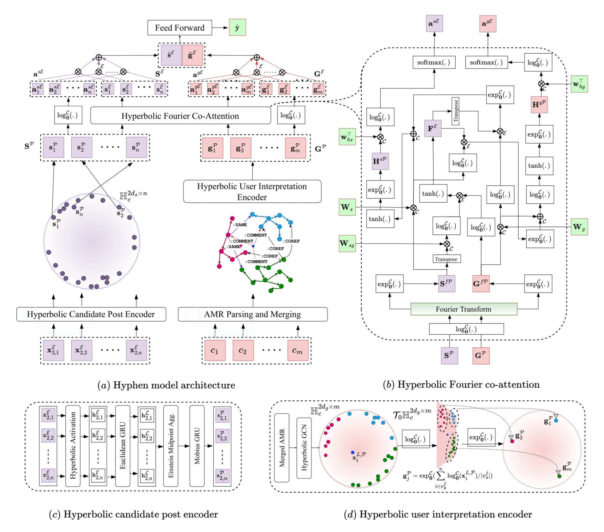

# Hyphen

Implementation of [Public Wisdom Matters! Discourse-Aware Hyperbolic Fourier Co-Attention for Social-Text Classification](https://arxiv.org/abs/2209.13017), accepted at NeurIPS 2022, as an **Oral** paper. 

**Authors**: [Karish Grover](https://karish-grover.github.io/), [S.M. Phaneendra Angara](https://www.linkedin.com/in/s-m-phaneendra-angara-9b94266), [Md. Shad Akhtar](http://faculty.iiitd.ac.in/~shad.akhtar/), [Tanmoy Chakraborty](https://www.tanmoychak.com/)

<p align="center">
  
</p>

## 🛠 Dependencies and Installation

- torch `1.11.0`
- geoopt `0.1.1` (Hyperbolic optimization and Maths)
- Penman `1.2.1` (Abstract Meaning Representation)
- dgl_cu111 `0.8.1` (Graphs)
- Other required packages in `requirements.txt`

```python
# git clone this repository
git clone https://github.com/LCS2-IIITD/Hyphen
cd Hyphen

# install python dependencies
pip3 install -r requirements.txt
```
## ⚡️ Quick inference

We have performed extensive experimentation and ablation studies across 4 tasks and 10 datasets i.e. **Fake news** detection (`antivax`, `politifact`, `gossipcop`), **Hate speech** detection (`hasoc`), **Sarcasm** detection (`figlang_twitter`, `figlang_reddit`), and **Rumour** detection (`twitter16`, `rumoureval`, `pheme`, `twitter15`). 

Download the final preprocessed dataset Pickle files from [here](https://drive.google.com/drive/folders/13bhShv0sgzpoUpkStJG4VAsHUZHzKPer?usp=sharing) for all 10 datasets, and save them as `data/{d_name}_preprocessed.pkl`. Next, to run the complete `Hyphen-hyperbolic` model on `politifact` dataset, use the following script:

```python
python3 run.py --manifold PoincareBall --lr 0.001 --dataset politifact  --batch-size 32 --epochs 5 --max-sents 20 --max-coms 10 --max-com-len 10 --max-sent-len 10 --log-path logging/run
```

Finally, to track the evolution of loss, accuracy, and other metrics throughout the training process, use tensorboard as follows:

```python
tensorboard --logdir logging/run
```

## 🛃 Custom dataset processing

Start with a `CSV` file of your custom dataset, named `d_name`, containing the columns - `id`, `text`, `comments`, and `labels`. 
- Each sample of this CSV file corresponds to a news post identified by `id`, containing content `text`, belonging to the class `label`, and having public discourse `comments` where individual comments are separated by `::`. 
- The comments are present in a string format, similar to `{comm_1}::{comm_2}:: ... ::{comm_n}`. Save this CSV file in the  `data` folder as: `data/{d_name}/{d_name}.csv`.
- We have provided these raw dataset files for all the 10 datasets in the [data](data/) folder (Eg. `data/politifact/politifact.csv`), feel free to check them out for understanding the format better.

### Abstract Meaning Representation (AMR) creation and merging

Firstly, we need to convert the user comments into AMRs. Generate the Abstract Meaning Representations for all user comments in a dataset, by running the following script from the root folder, `Hyphen`. Run AMR generation on a GPU for faster generation:
```python
python3 amr/amr_gen.py --dataset {d_name} --max-comments 50
```
This generates the AMR graphs for all the user comments mentioned during the input, and saves them at `{d_name}_amr/{d_name}_amr_csv/` in the form of `{d_name}_{post_id}.csv` files, where each `csv` files contains the generated AMR graphs for `max-comments` number of comments, for each social media post. Next, modify attributes and instances variable names across all AMRs:
```python
python3 amr/amr_var.py --dataset {d_name}
```

This will save the resultant AMR graphs in the form of their [Penman](https://penman.readthedocs.io/en/latest/notation.html) notation `{d_name}.amr.penman` at `{d_name}_amr/{d_name}_amr_coref/`. Each `.penman` file contains the relabelled AMR graphs. Next, we perform inter-comment [coreference resolution](https://github.com/bjascob/amr_coref) across AMR graphs of multiple comments corresponding to one social media post.

```python
python3 amr/amr_coref/amr_coref.py --dataset {d_name}
```

After coreference resolution, we get the file `{d_name}_amr/{d_name}_amr_coref.json`. The add edges labelled `:COREF` between the nodes present in a coreference cluster. Finally, we add the dummy node, and egdes and complete the final step in merging AMRs to form the macro-AMR. 

```python
python3 amr/amr_dummy.py --dataset {d_name}
```

This gives us the final merged AMRs for all the news posts at `{d_name}_amr/{d_name}_amr_merge/{d_name}_{id}.amr.penman`. Read the [paper](https://arxiv.org/abs/2209.13017) for more details on the AMR merging process. Specify the glove embedding path in `amr_dgl.py`. Convert the generated macro-AMRs to subgraphs in `DGL` format using:
```python
python3 amr/amr_dgl.py --dataset {d_name} --test-split 0.1
```
This creates `{d_name}.pkl`, `{d_name}_train.pkl` and `{d_name}_test.pkl` files, in which every sample is of the form:

```python
{'label':label, 'graph': dgl_graph, 'content': content, 'id': name, 'subgraphs':subgraphs}
```

### Final dataset preprocessing
Once you have prepared the AMR graphs, we bring the news sentences and AMRs together, and pass it through one last preprocessing step, which mainly includes shuffling, a few transformations and train-test splits. Specify the glove embedding path in `preprocess.py`. :

```python
python3 preprocess.py --dataset {d_name}
```

This will create the final dataset pickle file as `data/preprocessed_{d_name}.pkl`. The other intermediately processed files are available [here](https://drive.google.com/drive/folders/13bhShv0sgzpoUpkStJG4VAsHUZHzKPer?usp=sharing) for reference, for all 10 datasets.

## 🔂 Training

Specify the glove embedding path in `main.py`. Next, to run `Hyphen-hyperbolic` on  `politifact` dataset, use the following script.

```python
python3 run.py --manifold PoincareBall --lr 0.001 --dataset politifact  --batch-size 32 --epochs 5 --max-sents 20 --max-coms 10 --max-com-len 10 --max-sent-len 10 --log-path logging/run
```

You may also try various ablations of `Hyphen`. To run `Hyphen-euclidean w/o Fourier`, use the following script:

```python
python3 run.py --no-fourier --manifold Euclidean --lr 0.001 --dataset politifact  --batch-size 32 --epochs 5 --max-sents 20 --max-coms 10 --max-com-len 10 --max-sent-len 10 --log-path logging/run
```

To run `Hyphen-hyperbolic w/o Comments`, use the following script:

```python
python3 run.py --no-comments --manifold PoincareBall --lr 0.001 --dataset politifact  --batch-size 32 --epochs 5 --max-sents 20 --max-coms 10 --max-com-len 10 --max-sent-len 10 --log-path logging/run
```
To run `Hyphen-hyperbolic w/o Content`, use the following script:

```python
python3 run.py --no-content --manifold PoincareBall --lr 0.001 --dataset politifact  --batch-size 32 --epochs 5 --max-sents 20 --max-coms 10 --max-com-len 10 --max-sent-len 10 --log-path logging/run
```

Use the command-line arguments specified in [run.py](run.py) for experimenting with various ablations of `Hyphen`, and specifying the hyperparameters. Similarly, feel free to try other ablations of `Hyphen`, using the command-line arguments. Finally, to track the evolution of loss, accuracy, and other metrics throughout the training process, use tensorboard as follows:

```python
tensorboard --logdir logging/run
```

## 📚 Sentence-level Fact-checked Annotated dataset
### Hyphen fine-grained explainability evaluation - Annotated dataset *release*! 💿
 
We hereby release the annotated Politifact dataset. The dataset is present [here](annotation). This is the **first-ever sentence-level fact-checked dataset**. Find more details about the released dataset, format and the annotation details in the [ReadMe](annotation/annotation.md) file. 

**Abstract**: Fake news 📰 is often generated by **manipulating only a small part of the true information** i.e. entities, relations, small parts of a sentence, or a paragraph. It is possible that certain true information is also present in the news piece to make it more appealing to the public, and thus it is crucial to distinguish between true and/or fake parts of a piece of information. Thus, we utilise and release a **sentence-level fact-checked annotated dataset**. We annotate the **Politifact** dataset with ground truth evidence corresponding to different parts of the news text, by referring to fact-checking websites [Politifact](https://www.politifact.com/) and [Gossipcop](https://www.snopes.com/), and other trustable online sources. 

## 📞 Contact
If you have any questions or issues, please feel free to reach out [Karish Grover](https://karish-grover.github.io/) at <a href="mailto:karish19471@iiitd.ac.in">karish19471@iiitd.ac.in</a>.

## ✏️ Citation

If you think that this work is helpful, please feel free to leave a star ⭐️ and cite our paper:

```
@article{grover2022public,
  title={Public Wisdom Matters! Discourse-Aware Hyperbolic Fourier Co-Attention for Social Text Classification},
  author={Grover, Karish and Angara, SM and Akhtar, Md Shad and Chakraborty, Tanmoy},
  journal={Advances in Neural Information Processing Systems},
  volume={35},
  pages={9417--9431},
  year={2022}
}
```
